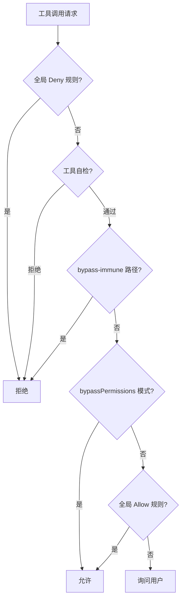
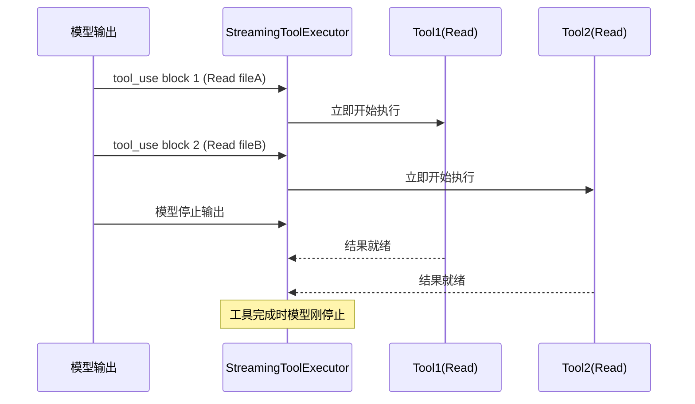

# ⛔ 已废弃 — 可视化规划文档（仅历史留存）

> **DEPRECATED 2026-04-10**：本文件严重滞后——只覆盖到 Part 3 Ch01（权限系统），完全没有 Ch02-Ch25 的图表条目，文件内统计"45 个图表"而项目实际已有 **122 张图表全部生产完成**。
>
> **权威图表追踪**：
> - `web/test-viz/chart-catalog.json`（122 图表元数据）
> - `web/test-viz/chart-embedding-map.json`（章节↔图表映射）
> - `web/test-viz/production/html/VIS-*`（生产图表 HTML）
> - `web/PROGRESS.md` 的"图表进度"一行
>
> 本文件下面的内容是阶段 0 的早期规划，**不反映项目当前状态**，仅作为早期设计思路的归档。

---

# 可视化规划文档（历史归档）

> 这是一份"图表预埋地图"。记录每个章节需要哪些图表、图表类型是什么、内容是什么。
> 后续统一制作时，对照此文档一一完成。

---

## 使用说明

每个图表条目格式：
- **编号**：`章节编号-字母`（如 `1.3-A`）
- **类型**：流程图 / 架构图 / 时序图 / 对比表 / 状态机图 / 矩阵图
- **核心内容**：图表要表达什么
- **数据来源**：对应的源文件/章节
- **优先级**：P0（必须有）/ P1（强烈建议）/ P2（加分项）

---

## Part 1：认识这个系统

### 第三章：读懂本书需要的全部概念

| 编号 | 类型 | 核心内容 | 优先级 |
|------|------|---------|--------|
| 1.3-A | 流程图 | Tool 调用循环：AI 请求 → 系统执行 → 结果返回 → AI 继续 | P0 |
| 1.3-B | 树状图 | Agent 层级：主 Agent → 子 Agent → 子子 Agent | P0 |
| 1.3-C | 垂直流程图 | 完整调用栈：用户输入 → REPL → QueryEngine → queryLoop → API → Tool → ... → 回答 | P0 |

### 第四章：八个子系统的全景地图

| 编号 | 类型 | 核心内容 | 优先级 |
|------|------|---------|--------|
| 1.4-A | 架构图 | 八个子系统的空间布局和连接关系（主执行引擎居中，其他围绕） | P0 |
| 1.4-B | 时序图 | StreamingToolExecutor：模型输出 vs 工具执行的并行时间线 | P0 |
| 1.4-C | 状态机图 | 权限十步状态机的流程（从工具调用请求到 Allow/Ask/Deny） | P0 |
| 1.4-D | 层叠图 | System Prompt 的组装：各来源（CLAUDE.md/工具/设置/上下文）叠加 | P1 |
| 1.4-E | 时序图 | 后台任务与主循环的关系：主循环完成 → 触发 SessionMemory + Suggestion | P1 |
| 1.4-F | 层级图 | 扩展系统三层：Plugin（顶层）→ MCP/Hooks/Commands（中层）→ 事件/工具（底层） | P1 |
| 1.4-G | 矩阵图 | 八个子系统的依赖关系矩阵（行=调用者，列=被调用者） | P2 |

---

## Part 2：好奇心驱动的深度问答

### Q01：那三行在 import 之前的代码

| 编号 | 类型 | 核心内容 | 优先级 |
|------|------|---------|--------|
| 2.1-A | 时序图 | 模块加载期间（135ms）的并行操作：MDM读取 + Keychain 预取 + 模块加载 | P0 |

### Q02：上下文压缩为什么需要六套机制

| 编号 | 类型 | 核心内容 | 优先级 |
|------|------|---------|--------|
| 2.2-A | 进度条/漏斗图 | 六套机制的触发阈值和压缩程度：从"丢弃工具结果细节"到"完整对话摘要" | P0 |
| 2.2-B | 流程图 | 每层机制的触发条件和处理方式 | P1 |

### Q03：子 Agent 是怎么被创建和管理的

| 编号 | 类型 | 核心内容 | 优先级 |
|------|------|---------|--------|
| 2.3-A | 树状图 | Coordinator 模式下的 Agent 层级：Coordinator → 专业 Agent × N | P0 |
| 2.3-B | 时序图 | Agent 创建-执行-返回的完整生命周期 | P1 |

### Q04：工具为什么能在模型还没停止说话时就开始执行

| 编号 | 类型 | 核心内容 | 优先级 |
|------|------|---------|--------|
| 2.4-A | 对比时序图 | 传统串行执行 vs StreamingToolExecutor 并行执行的时间对比 | P0 |

### Q05：权限系统是怎么在灵活性和安全性之间走钢丝的

| 编号 | 类型 | 核心内容 | 优先级 |
|------|------|---------|--------|
| 2.5-A | 流程图 | 十步权限状态机（从工具调用到 Allow/Ask/Deny 的完整判断链） | P0 |
| 2.5-B | 金字塔图 | 六种权限模式的层级（从最严格 plan 到最宽松 bypassPermissions） | P0 |
| 2.5-C | 对比表 | Auto 模式三条快路径：条件 → 处理方式 → 速度 | P1 |

### Q06：Claude 在你打字的时候偷偷在做什么

| 编号 | 类型 | 核心内容 | 优先级 |
|------|------|---------|--------|
| 2.6-A | 时间轴图 | 投机执行全流程：Claude 回答完 → 预测 → 偷跑 → 你按 Enter → 命中/未命中 | P0 |
| 2.6-B | 文件系统图 | COW 覆盖层：主目录 + overlay 目录的写入/合并/丢弃逻辑 | P1 |

### Q07：CLAUDE.md 是怎么被找到和组装的

| 编号 | 类型 | 核心内容 | 优先级 |
|------|------|---------|--------|
| 2.7-A | 目录遍历图 | 从当前目录到 $HOME 的向上遍历，找到所有 .claude/CLAUDE.md | P0 |
| 2.7-B | 优先级堆叠图 | 六种记忆类型的优先级（Managed > User > Project > Local > AutoMem > TeamMem）及其在 context 中的位置 | P0 |

### Q08：设置系统为什么需要五层优先级

| 编号 | 类型 | 核心内容 | 优先级 |
|------|------|---------|--------|
| 2.8-A | 金字塔/漏斗图 | 五层设置来源的优先级（policySettings 在顶部，userSettings 在底部） | P0 |
| 2.8-B | 对比表 | 数组字段 vs 对象字段的合并行为差异（完全替换 vs 深度合并） | P1 |

### Q09：Session 里那个默默记笔记的 AI 是谁

| 编号 | 类型 | 核心内容 | 优先级 |
|------|------|---------|--------|
| 2.9-A | 时序图 | SessionMemory 触发条件和执行时机（三个阈值 + sequential 串行化） | P1 |
| 2.9-B | 卡片图 | session-memory.md 的 9 个节结构 | P1 |

### Q10：用户能在 Claude 的生命周期里插多少个钩子

| 编号 | 类型 | 核心内容 | 优先级 |
|------|------|---------|--------|
| 2.10-A | 生命周期图 | Claude 完整生命周期上的 27 个事件节点分布（按会话/工具/权限/AI轮次等分类） | P0 |
| 2.10-B | 对比表 | 退出码语义对照表（0/2/其他 × 不同 Hook 事件的效果） | P0 |
| 2.10-C | 流程图 | Agent Hook 执行流程（多轮 AI → 结构化输出 → ok/not ok → 阻断/继续） | P2 |

### Q11：对话也可以像代码一样分支和回滚吗

| 编号 | 类型 | 核心内容 | 优先级 |
|------|------|---------|--------|
| 2.11-A | Git 风格分支图 | 对话分支：主线 → /branch → 分支线，两线独立发展 | P0 |
| 2.11-B | 目录结构图 | JSONL 文件格式：每条消息的字段结构（uuid/parentUuid/sessionId/forkedFrom） | P1 |

### Q12：插件系统是怎么防止你被恶意扩展攻击的

| 编号 | 类型 | 核心内容 | 优先级 |
|------|------|---------|--------|
| 2.12-A | 同心圆/洋葱图 | 插件安全的六层防御（从最外层工作区信任到最内层 Hooks 来源标记） | P0 |

### Q13：Skills 和斜杠命令有什么本质区别

| 编号 | 类型 | 核心内容 | 优先级 |
|------|------|---------|--------|
| 2.13-A | 对比表 | Commands vs Skills：触发方式/whenToUse/user-invocable/来源 等维度对比 | P0 |
| 2.13-B | 流程图 | Skills 的 6 种加载来源和优先级 | P1 |

### Q14：多个 Claude 实例是怎么协同工作的

| 编号 | 类型 | 核心内容 | 优先级 |
|------|------|---------|--------|
| 2.14-A | 拓扑图 | Swarm 架构：Leader 居中，Teammates 分布，通信/权限路径标注 | P0 |
| 2.14-B | 对比表 | 三种 Backend：tmux/iTerm2/in-process 的特性对比 | P1 |
| 2.14-C | 时序图 | 权限同步流程：Teammate 请求 → Leader 弹窗 → 决定 → 传回 Teammate | P1 |

---

## Part 3：子系统完全解析

### 01：权限系统完全解析

| 编号 | 类型 | 核心内容 | 优先级 |
|------|------|---------|--------|
| 3.1-A | 详细流程图 | 十步状态机（带代码引用的完整版，比 Part 2 更详细） | P0 |
| 3.1-B | 状态图 | 六种权限模式的切换条件（什么情况下进入/退出各模式） | P0 |
| 3.1-C | 时序图 | Iron Gate 触发：分类器连续拒绝 3 次 → 回退人工审批 | P1 |

---

## Part 4：工程哲学

### 01：在等待时间里藏工作

| 编号 | 类型 | 核心内容 | 优先级 |
|------|------|---------|--------|
| 4.1-A | 并行时间轴 | 三个层次的"等待中藏工作"：模块加载/工具执行/用户思考 三行时间轴对比 | P0 |

### 02：Token 是一等公民

| 编号 | 类型 | 核心内容 | 优先级 |
|------|------|---------|--------|
| 4.2-A | 饼图/面积图 | Cache hit rate 前后对比：effort:'low' 引起 92.7% → 61%，写入激增 45× | P1 |

### 03：把 AI 当乐高积木

| 编号 | 类型 | 核心内容 | 优先级 |
|------|------|---------|--------|
| 4.3-A | 对比表 | 七种 AI 实例的参数配置对比（querySource/tools/canUseTool/setAppState） | P0 |

### 04：多层防线不是偏执，是必要

| 编号 | 类型 | 核心内容 | 优先级 |
|------|------|---------|--------|
| 4.4-A | 城墙/洋葱图 | 六层防线：从最外层企业策略到最内层 Hooks，每层对应的威胁 | P0 |

---

## Part 5：批判与超越

### 02：如果我来重新设计

| 编号 | 类型 | 核心内容 | 优先级 |
|------|------|---------|--------|
| 5.2-A | 对比表 | 五个重设计思路：现状痛点 vs 理想设计 | P1 |

---

## 图表制作优先级汇总

**P0（必须有，影响理解）**：共 **22 个**
- 1.3-A, 1.3-B, 1.3-C
- 1.4-A, 1.4-B, 1.4-C
- 2.1-A, 2.2-A, 2.4-A, 2.5-A, 2.5-B, 2.6-A, 2.7-A, 2.7-B, 2.8-A
- 2.10-A, 2.10-B, 2.11-A, 2.12-A, 2.13-A, 2.14-A
- 3.1-A, 3.1-B, 4.1-A, 4.3-A, 4.4-A

**P1（强烈建议，提升理解效率）**：共 **18 个**
- 余下的 P1 条目

**P2（加分项，适合进阶版）**：共 **5 个**
- 余下的 P2 条目

---

## 图表类型说明

| 类型 | 适合表达 | 工具建议 |
|------|---------|---------|
| 流程图 | 步骤、判断、分支 | Mermaid flowchart |
| 时序图 | 多方交互的时间顺序 | Mermaid sequenceDiagram |
| 状态机图 | 状态转换 | Mermaid stateDiagram |
| 架构图 | 组件空间关系 | 手绘 / Excalidraw / draw.io |
| 对比表 | 两种方案/概念的维度对比 | Markdown 表格 |
| 树状图 | 层级关系 | Mermaid graph |
| 时间轴 | 并行任务的时间对比 | 自定义 ASCII 或 Mermaid gantt |
| 金字塔/漏斗 | 优先级层级 | 手绘 / 竖排表格 |
| 洋葱/同心圆 | 包含关系、防御层级 | 手绘 |

---

## Mermaid 示例模板

以下是几个常用图表的 Mermaid 代码模板，方便快速制作：

### 流程图模板（权限状态机）

### 时序图模板（StreamingToolExecutor）

